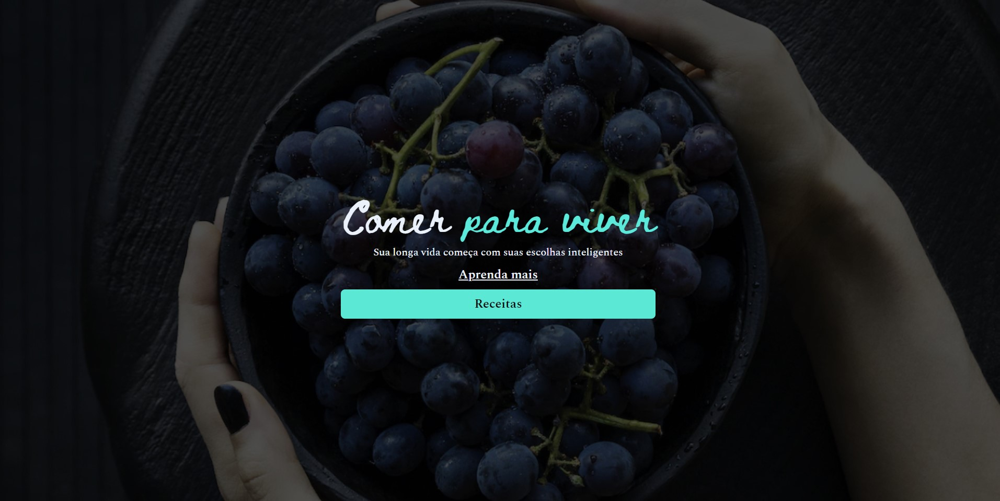

<h1 align="center"> Habits </h1>

Land Page aula 2, promovido pela Rocketseat para ensino de tecnologias WEB.  

  

## 🚀 Tecnologias

Esse projeto foi desenvolvido com as seguintes tecnologias:

- HTML e CSS
- Git e Github
- Figma

## 💻 Projeto

Pagina web desenvolvida para  ajudar a relembrar conceitos do HTML e CSS.

- [visite o projeto online] (https://gsilvaol.github.io/nlw-setup/)

Feito com ♥ by Rocketseat :wave: [Participe da nossa comunidade!](https://discord.gg/rocketseat)